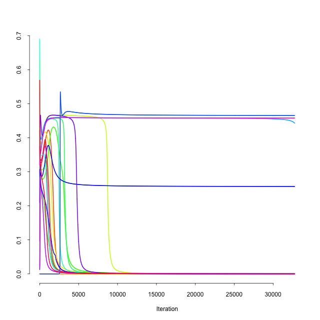
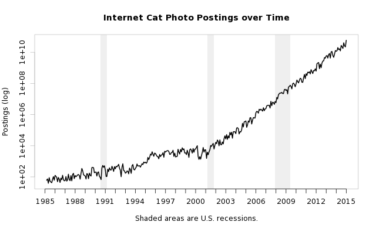

# r-fu

r-fu is a wrapper around R (http://www.r-project.org) that provides a
means to toss arbitrary data sets at named R code templates that are fed
to R. See the "arlets" directory for the available templates of R code.
Basically this is some glue to help make R work better from the unix
command line (or Makefile, etc.) environment.

Assuming that perl and App::cpanminus are installed, a quick test might
look like:

    $ make depend
    $ env ARLET_DIR=arlets ./r-fu echo test
    [1] "test"

Or, perhaps more interesting:

    awk '{print length}' /usr/share/dict/words \
    | env ARLET_DIR=arlets ./r-fu barplot - out.pdf

While a proper install under a home directory might look something like:

    # assuming ~/bin exists and is in $PATH
    cp r-fu ~/bin

    # or some other dir and exporting ARLET_DIR, etc.
    mkdir ~/share
    cp -r arlets ~/share

    # only on ZSH, $fpath may need customization, etc.
    cp _r-fu $fpath[0]   

Or otherwise fiddle with the paths (and possibly the source code for the
arlets directory) if other paths are desired. Then read the docs on r-fu
for more information:

    perldoc r-fu

Motivation for this NIH system: other options, such as learning R more
soas to be comfortable in its REPL, or using some webby thing or knitr,
do not suit the Unix + Perl + C + no Internet environment I spend most
of my time in, and my prior practice of copying and pasting random R
commands from who knows where did not promote proper scriptability:

    for i in {1..20}; do ./nntrain > out$i; done
    paste out* | r-fu linesnox --xlabel=Iteration - training.png

See also Statistics::NiceR for another Perl integration with R, or GNU
datamash for another option for command line data wrangling.

And now, what you've all been waiting for.

